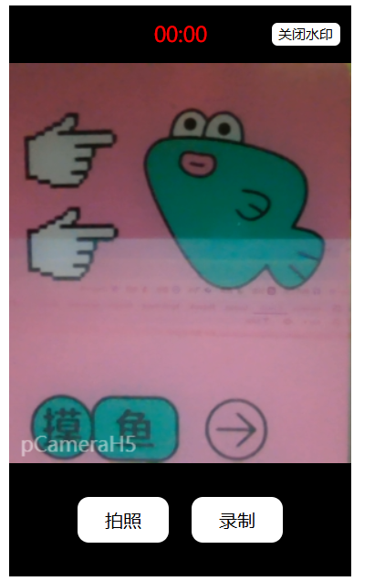

````markdown
## p-camera-h5 官方文档

[](https://github.com/pbstar/p-camera-h5)
[](https://www.npmjs.com/package/p-camera-h5)
[](https://bundlephobia.com/package/p-camera-h5)
[](https://pbstar.github.io/p-camera-h5-demo/)

一款轻量级 H5 相机插件，支持拍照、录像、水印定制、样式定制等功能，适配现代浏览器。



---

### 功能特性

- 📸 拍照（支持 PNG 格式）
- 🎥 录像（MP4 格式，最长 60 秒）
- 🖼️ 动态水印（文字/位置/颜色/字体大小）
- ⚡ 极简 API，易于集成
- 🔧 高度可配置化，样式自定义，满足个性化需求

---

### 安装

#### NPM 安装

```bash
npm install p-camera-h5 --save
```
````

#### CDN 引入

```html
<script src="https://unpkg.com/p-camera-h5@latest/dist/p-camera-h5.umd.js"></script>
```

---

### 快速开始

```html
<div id="camera-container" style="width: 300px; height: 500px;"></div>
```

```javascript
import pCameraH5 from "p-camera-h5";

const camera = new pCameraH5({
  el: document.getElementById("camera-container"),
  watermark: {
    text: "pCameraH5",
    position: "bottom-left",
    color: "rgba(255, 255, 255, 0.8)",
    fontSize: "14px",
  },
});

// 事件监听
camera.on("capture", (file) => {
  console.log("拍照结果:", file);
  camera.downloadFile(file, "photo.png");
});

camera.on("record", (file) => {
  console.log("录像结果:", file);
  camera.downloadFile(file, "video.mp4");
});
```

---

### 配置项

| 参数      | 类型        | 默认值                                                                                             | 说明            |
| --------- | ----------- | -------------------------------------------------------------------------------------------------- | --------------- |
| el        | HTMLElement | **必填**                                                                                           | 挂载容器元素    |
| style     | string      | `""`                                                                                               | 自定义 CSS 样式 |
| watermark | object      | `{ text: "pCameraH5", position: "bottom-left", color: "rgba(255,255,255,0.5)", fontSize: "18px" }` | 水印配置        |

---

### API 方法

| 方法               | 说明               |
| ------------------ | ------------------ |
| `init()`           | 初始化摄像头       |
| `capture()`        | 拍摄照片           |
| `startRecording()` | 开始录像           |
| `stopRecording()`  | 停止录像           |
| `destroy()`        | 销毁实例并释放资源 |
| `downloadFile()`   | 下载文件（File）   |

---

### 事件系统

```javascript
// 监听事件
camera.on("capture", (file) => {
  /* 处理照片 */
});
camera.on("record", (file) => {
  /* 处理视频 */
});

// 移除事件
camera.off("capture");
```

---

### 注意事项

1. **HTTPS 环境**：浏览器要求安全上下文（本地 localhost 除外）
2. **用户授权**：首次使用需允许摄像头和麦克风权限
3. **移动端适配**：建议添加以下 viewport 配置：
   ```html
   <meta
     name="viewport"
     content="width=device-width, initial-scale=1.0, maximum-scale=1.0, user-scalable=no"
   />
   ```
4. **录像限制**：最长录制时间为 60 秒

---

### 开发指南

```bash
git clone https://github.com/pbstar/p-camera-h5.git
npm install
npm run build
```

欢迎提交 Issue 和 PR！🚀

```
https://github.com/pbstar/p-camera-h5/issues
```
